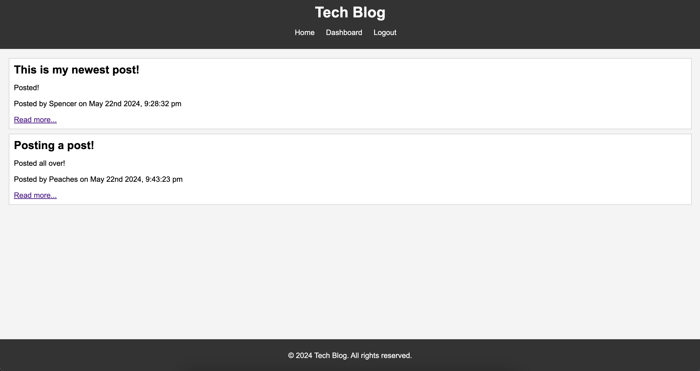

# Tech Blog

## Description

Tech Blog is a CMS-style blog site where developers can publish their blog posts and comment on other developers’ posts. The application is built using the MVC paradigm, with Handlebars.js as the templating engine, Sequelize as the ORM, and express-session for authentication. The application is deployed on Heroku.

## Table of Contents

- [Description](#description)
- [Screenshot](#screenshot)
- [Installation](#installation)
- [Usage](#usage)
- [Features](#features)
- [License](#license)
- [Contributing](#contributing)
- [Links](#links)
- [Questions](#questions)

## Screenshot

## Installation

To get a local copy of this project up and running, follow these steps:

   Clone the repository:
   git clone https://github.com/your-username/tech-blog.git
   cd tech-blog
Install dependencies:

bash
Copy code
npm install
Set up the database:

- MySQL installed and running.
- Log into MySQL and create the database:
- sql
- Copy code
- CREATE DATABASE tech_blog_db;

Configure environment variables:

- Create a .env file in the root directory and add your database credentials:
- makefile
- Copy code
- DB_NAME=tech_blog_db
- DB_USER=your_mysql_username
- DB_PW=your_mysql_password
- Run the application:

- Sync the database and start the server:
- bash
- Copy code
- npm start
- For development with automatic restarts, use:
- bash
- Copy code
- npm run dev

## Usage
- Sign up for an account.
- Log in to your account.
- Create, edit, and delete posts.
- View and comment on other developers' posts.
- Log out when done.

## Features
- User authentication (signup, login, logout)
- Create, read, update, and delete blog posts
- Comment on posts
- Responsive design

## License
- This project is licensed under the MIT License. See the LICENSE file for details.

## Contributing
Contributions are welcome! Please fork the repository and submit a pull request for any enhancements or bug fixes.

## Links
- Heroku :
- GitHub : 

## Questions
If you have any questions about the project, feel free to reach out:

GitHub: spencerklink    
Email: sklinkowize7@gmail.com